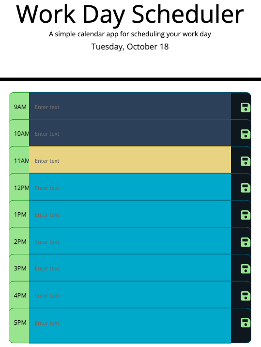

# WorkDayScheduler

## Description

This application schedules the nine to five workday hours. If the hour has passed the time slot is represented in dark blue.  Current hour is represented in yellow.  Future hours are represented in light blue. When a user clicks the time slot they are able to enter or alter text.  Pushing the green disk button allows the user to save the text.

[Click Here for Deployed Link](https://iqbalahmadi.github.io/Work-Day-Scheduler/)

  

## Description 
This repo provides a timed quiz on JavaScript fundamentals that stores high scores. 

## Built With

- HTML
- CSS
- JavaScript

## Usage

- When you click the start button
- Then a timer starts and you are presented with a question
- When you answer a question
- Then you are presented with another question
- When you answer a question incorrectly
- Then time is subtracted from the clock
- When all questions are answered or the timer reaches 0
- Then the game is over
- When the game is over
- Then you can save your initials and your score

## Screenshot of the Page

The following image shows the website's current state

  

